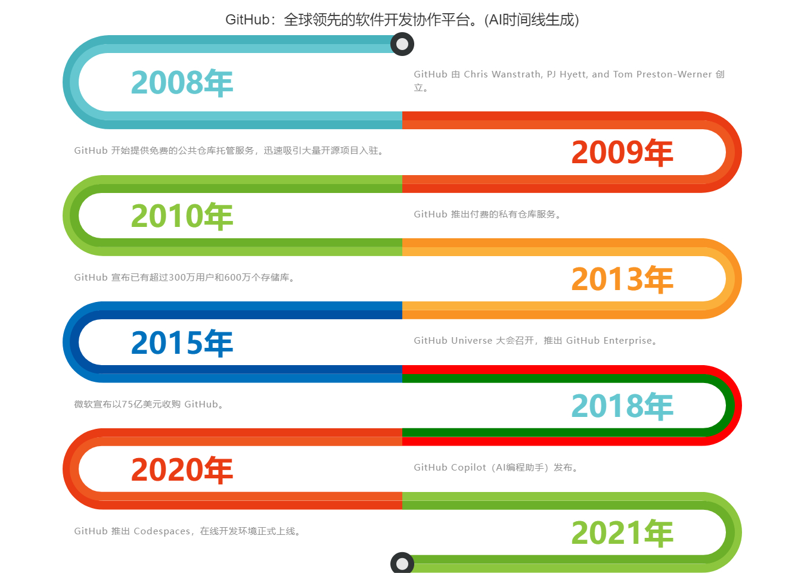

产品介绍： AI时间线

产品地址： http://www.ai-timeline.top

使用教程：使用教程可以看右上角“使用教程”

Github AI时间线：

AI时间线开发、变现、运营历程分享：

**创业篇：https://zhuanlan.zhihu.com/p/688823353**

整体历程：https://note.mowen.cn/note/detail?noteUuid=mfcz25BdfCb895Hk31Lsl

技术篇：https://note.mowen.cn/note/detail?noteUuid=RGXfh4tOmCk7COzDakmsE

商业篇：https://note.mowen.cn/note/detail?noteUuid=Msqnuz5c4B_bOF3AETdzc

营销篇：https://note.mowen.cn/note/detail?noteUuid=KQE4YSMmMb2ybj4yJmKEQ

流量篇：https://note.mowen.cn/note/detail?noteUuid=EKtHKDVXTMd2uneqXh3Z2

数据篇：https://note.mowen.cn/note/detail?noteUuid=hubT310cbkk2UQz76Brnl

代码比较混乱，主要实现业务逻辑，各位轻拍哈

**商业化使用请注明出处**

twitter: https://twitter.com/zhugezifang

交流群和联系方式(备注AI时间线)

